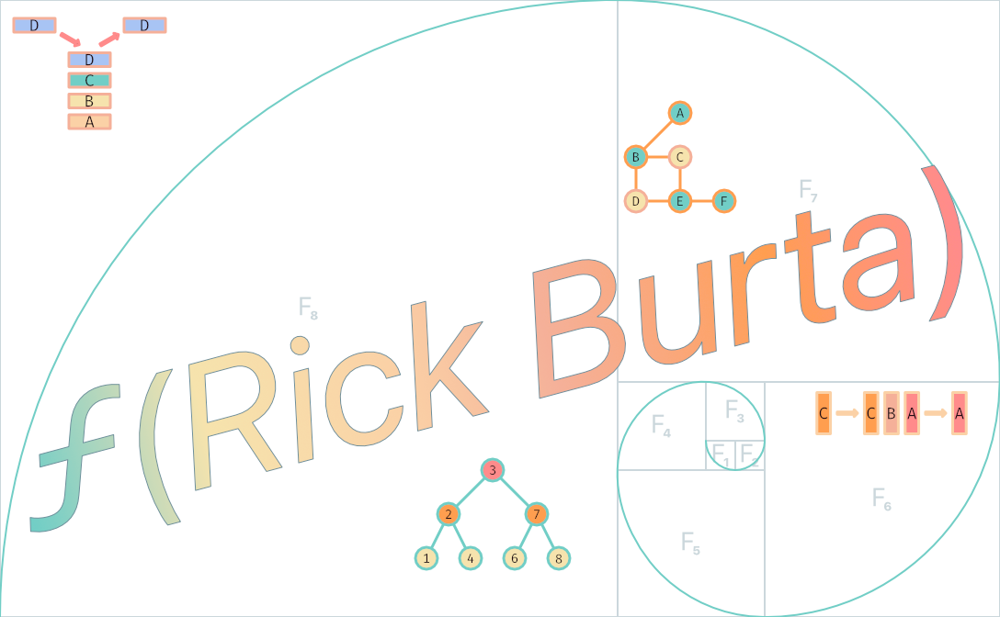

<h1 align="center">
    
</h1>

I - am a software engineer; love puzzles, patterns, and building things; have been obsessed with computers and AGI since I was a kid. There's an indescribable sense of fulfillment that comes from solving a challenging puzzle, recognizing an abstract pattern, or combining raw elements and imagination into something that can better the lives of others. For the last 8+ years I've been helping organizations obtain that sense of fulfillment by designing resilient systems and developing scalable solutions to complex problems.

## Connect with me
 
  

## :hammer_and_wrench: Technologies & Tools

## Interests
* AGI :alembic:
* Basketball :basketball:
* Chess :chess_pawn:
* Mathematics :abacus:
* Patterns :brain:
* Puzzles :jigsaw:
* Robotics :robot:

